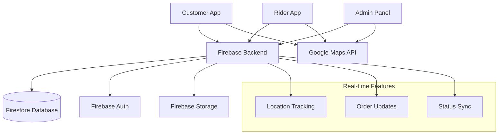

# 🚚 Bagicha Rider App - Complete Implementation Guide

## 📋 Table of Contents

1. [Overview](#overview)
2. [System Architecture](#system-architecture)
3. [Features Implemented](#features-implemented)
4. [Setup & Configuration](#setup--configuration)
5. [Firebase Integration](#firebase-integration)
6. [Google Maps Integration](#google-maps-integration)
7. [File Structure & Components](#file-structure--components)
8. [Admin Panel Integration](#admin-panel-integration)
9. [Rider Dashboard](#rider-dashboard)
10. [Customer Tracking](#customer-tracking)
11. [Testing & Verification](#testing--verification)
12. [Deployment](#deployment)
13. [Troubleshooting](#troubleshooting)

---

## 🚀 Overview

The Bagicha Rider App is a comprehensive delivery management system designed for plant and gardening product delivery. It includes a complete ecosystem with three main interfaces:

- **🏪 Admin Panel**: Rider management, order assignment, and live tracking oversight
- **🚚 Rider App**: Mobile-first delivery interface with GPS tracking and order management  
- **👥 Customer Interface**: Real-time order tracking and delivery updates

### Key Technologies
- **Frontend**: Next.js 14, React, TypeScript, Tailwind CSS
- **Backend**: Firebase (Firestore, Authentication, Storage)
- **Maps**: Google Maps JavaScript API
- **UI/UX**: Framer Motion, Lucide Icons, React Icons
- **Authentication**: Firebase Phone Authentication with OTP

---

## 🏗️ System Architecture



### Data Flow
1. **Order Creation**: Customer places order → Stored in Firestore
2. **Admin Assignment**: Admin assigns rider → Real-time update to rider app
3. **Rider Workflow**: Pickup → In Transit → Delivered (with GPS tracking)
4. **Customer Updates**: Real-time status updates and live map tracking

---

## ✅ Features Implemented

### 🎯 Core Features

#### **Admin Panel** (`/admin`)
- ✅ **Rider Management** (`/admin/riders`)
  - Complete rider registration system
  - Real-time status monitoring (online/offline/busy)
  - Performance analytics and ratings
  - Search and filter functionality
  - Status controls and location tracking
  - Vehicle information management

- ✅ **Order Management** (`/admin/orders`)
  - Rider assignment workflow
  - Live tracking modal with real-time maps
  - Order status management
  - Bulk operations and notes
  - Order filtering and search

- ✅ **Analytics Dashboard** (`/admin/analytics`)
  - Live tracking metrics
  - Rider performance analytics
  - Real-time delivery statistics
  - Route optimization insights

#### **Rider Dashboard** (`/rider`)
- ✅ **Authentication System**
  - Phone number + OTP verification
  - Session management with localStorage
  - Automatic redirect handling
  - Rider verification against admin database

- ✅ **Order Management**
  - View assigned orders with complete details
  - Pickup order functionality
  - Start delivery process
  - Complete delivery with photo proof
  - Customer contact integration

- ✅ **Status Management**
  - Online/Offline status toggle
  - Busy status when handling orders
  - Location tracking when online
  - Statistics tracking (deliveries, earnings, ratings)

- ✅ **Navigation & Tracking**
  - Real-time GPS location tracking
  - Google Maps navigation integration
  - Route optimization
  - ETA calculations

#### **Customer Tracking** (`/track-order/[orderId]`)
- ✅ **Real-time Tracking**
  - Live map with rider location
  - Order status timeline
  - ETA estimates and delivery updates
  - Rider contact functionality

- ✅ **Order History** (`/account`)
  - Complete order tracking
  - Live tracking integration
  - Order status updates

---

## 🛠️ Setup & Configuration

### 1. Environment Variables

Create `.env.local` file in your project root:

```env
# Firebase Configuration
NEXT_PUBLIC_FIREBASE_API_KEY=your_firebase_api_key
NEXT_PUBLIC_FIREBASE_AUTH_DOMAIN=your_project.firebaseapp.com
NEXT_PUBLIC_FIREBASE_PROJECT_ID=your_project_id
NEXT_PUBLIC_FIREBASE_STORAGE_BUCKET=your_project.appspot.com
NEXT_PUBLIC_FIREBASE_MESSAGING_SENDER_ID=your_sender_id
NEXT_PUBLIC_FIREBASE_APP_ID=your_app_id

# Google Maps API Configuration
NEXT_PUBLIC_GOOGLE_MAPS_API_KEY=your_google_maps_api_key
```

### 2. Dependencies Installation

```bash
npm install @googlemaps/js-api-loader react-google-maps
npm install firebase framer-motion lucide-react react-icons
npm install @types/google.maps (if using TypeScript)
```

### 3. Google Maps API Setup

1. **Enable Required APIs** in Google Cloud Console:
   - Maps JavaScript API
   - Geocoding API
   - Directions API
   - Distance Matrix API
   - Places API

2. **API Key Configuration**:
   - Create API key in Google Cloud Console
   - Set HTTP referrer restrictions for security
   - Limit to specific APIs only
   - Monitor usage and quotas

3. **Billing Setup**:
   - Enable billing account (required for production)
   - Set up usage quotas and alerts

---

## 🔥 Firebase Integration

### Database Collections

```javascript
// Firestore Collections Structure
{
  "riders": {
    "rider_id": {
      "name": "string",
      "phone": "string",
      "email": "string",
      "vehicleType": "bike|scooter|cycle",
      "vehicleNumber": "string",
      "status": "online|offline|busy",
      "currentLocation": { "lat": number, "lng": number },
      "currentOrderId": "string",
      "totalDeliveries": number,
      "rating": number,
      "isActive": boolean,
      "createdAt": timestamp,
      "lastLocationUpdate": timestamp
    }
  },
  
  "orders": {
    "order_id": {
      "customerPhone": "string",
      "items": array,
      "address": object,
      "total": number,
      "status": "pending|assigned|picked_up|out_for_delivery|delivered",
      "riderId": "string",
      "assignedAt": timestamp,
      "createdAt": timestamp,
      "updatedAt": timestamp
    }
  },
  
  "order_tracking": {
    "tracking_id": {
      "orderId": "string",
      "riderId": "string",
      "currentLocation": { "lat": number, "lng": number },
      "customerLocation": { "lat": number, "lng": number },
      "status": "string",
      "estimatedArrival": timestamp,
      "trackingEvents": array,
      "createdAt": timestamp,
      "updatedAt": timestamp
    }
  }
}
```

### Firebase Security Rules

```javascript
// Firestore Security Rules
rules_version = '2';
service cloud.firestore {
  match /databases/{database}/documents {
    // Riders collection - readable by riders and admin
    match /riders/{riderId} {
      allow read, write: if request.auth != null;
    }
    
    // Orders collection - riders can only read assigned orders
    match /orders/{orderId} {
      allow read: if request.auth != null;
      allow write: if request.auth != null;
    }
    
    // Order tracking - real-time updates
    match /order_tracking/{trackingId} {
      allow read, write: if request.auth != null;
    }
    
    // Customers can track their orders
    match /customers/{customerId} {
      allow read, write: if request.auth != null;
    }
  }
}
```

### Firebase Functions (Key Implementation)

#### Rider Authentication
```typescript
// lib/firebase.ts - Rider Authentication
export const authenticateRider = async (phoneNumber: string, otp: string, confirmationResult: any) => {
  try {
    // Verify OTP
    const result = await confirmationResult.confirm(otp)
    const user = result.user
    
    // Check if rider exists in database
    const ridersRef = collection(db, 'riders')
    const q = query(ridersRef, where('phone', '==', phoneNumber))
    const querySnapshot = await getDocs(q)
    
    if (querySnapshot.empty) {
      throw new Error('Rider not found. Please contact admin.')
    }
    
    const riderDoc = querySnapshot.docs[0]
    const riderData = { id: riderDoc.id, ...riderDoc.data() }
    
    return riderData
  } catch (error) {
    console.error('Error authenticating rider:', error)
    throw error
  }
}
```

#### Real-time Location Updates
```typescript
// Real-time location tracking
export const updateRiderLocation = async (riderId: string, location: {lat: number, lng: number}) => {
  try {
    const riderRef = doc(db, 'riders', riderId)
    await updateDoc(riderRef, {
      currentLocation: location,
      lastLocationUpdate: new Date()
    })
  } catch (error) {
    console.error('Error updating rider location:', error)
    throw error
  }
}
```

---

## 🗺️ Google Maps Integration

### LiveTrackingMap Component

The core mapping component provides real-time tracking capabilities:

**File**: `components/LiveTrackingMap.tsx`

#### Key Features:
- **Real-time Location Updates**: Syncs with Firebase for live rider positions
- **Route Calculation**: Uses Google Directions API for ETA estimates
- **Marker Management**: Custom markers for riders and delivery locations
- **Map Bounds**: Automatically fits view to show all relevant locations

#### Implementation Highlights:

```typescript
// Google Maps Initialization
const initializeMap = async () => {
  const { Loader } = await import('@googlemaps/js-api-loader')
  
  const loader = new Loader({
    apiKey: process.env.NEXT_PUBLIC_GOOGLE_MAPS_API_KEY || '',
    version: 'weekly',
    libraries: ['places', 'geometry']
  })

  const google = await loader.load()
  
  if (mapRef.current) {
    googleMapRef.current = new google.maps.Map(mapRef.current, {
      center: { lat: 28.6139, lng: 77.2090 }, // Default center
      zoom: 12,
      styles: [/* Custom map styling */]
    })
  }
}
```

#### ETA Calculation:
```typescript
const calculateETA = async (from: {lat: number, lng: number}, to: {lat: number, lng: number}) => {
  const service = new google.maps.DirectionsService()
  
  service.route({
    origin: from,
    destination: to,
    travelMode: google.maps.TravelMode.DRIVING,
    avoidHighways: false,
    avoidTolls: false
  }, (result, status) => {
    if (status === google.maps.DirectionsStatus.OK && result) {
      const route = result.routes[0]
      const leg = route.legs[0]
      setEta(leg.duration?.text || null)
    }
  })
}
```

### Integration Points

1. **Admin Panel**: Live tracking modal in order management
2. **Customer Interface**: Real-time delivery tracking
3. **Rider App**: Navigation and route optimization

---

## 📁 File Structure & Components

### Core Application Structure

```
operation_Bagicha/
├── app/
│   ├── admin/
│   │   ├── riders/
│   │   │   └── page.tsx                 # Rider management interface
│   │   ├── orders/
│   │   │   └── page.tsx                 # Order management with live tracking
│   │   ├── analytics/
│   │   │   └── page.tsx                 # Analytics dashboard
│   │   └── layout.tsx                   # Admin layout with navigation
│   ├── rider/
│   │   ├── login/
│   │   │   └── page.tsx                 # Rider authentication
│   │   ├── page.tsx                     # Main rider dashboard
│   │   └── layout.tsx                   # Rider app layout
│   ├── track-order/
│   │   └── [orderId]/
│   │       └── page.tsx                 # Customer order tracking
│   └── account/
│       └── page.tsx                     # Customer account with tracking
├── components/
│   ├── LiveTrackingMap.tsx              # Core mapping component
│   ├── AddressForm.tsx                  # Address management
│   ├── OrderSummary.tsx                 # Order display components
│   └── WishlistButton.tsx               # Product interaction
├── lib/
│   ├── firebase.ts                      # Firebase configuration & functions
│   └── useComponentConfig.ts            # Component configuration hook
└── context/
    ├── CartContext.tsx                  # Shopping cart state
    └── WishlistContext.tsx              # Wishlist state management
```

### Key Component Implementations

#### 1. Rider Dashboard (`app/rider/page.tsx`)

**Features**:
- Real-time order management
- GPS location tracking
- Status management (online/offline/busy)
- Order workflow (pickup → delivery → completion)
- Performance statistics

**Code Highlights**:
```tsx
// Location tracking implementation
const startLocationTracking = () => {
  navigator.geolocation.getCurrentPosition(
    (position) => {
      const location = {
        lat: position.coords.latitude,
        lng: position.coords.longitude
      }
      setCurrentLocation(location)
      updateRiderLocationInDB(location)
    },
    (error) => console.error('Error getting location:', error),
    { enableHighAccuracy: true }
  )

  // Continuous tracking every 5 seconds
  locationIntervalRef.current = setInterval(() => {
    // Update location logic
  }, 5000)
}
```

#### 2. Admin Rider Management (`app/admin/riders/page.tsx`)

**Features**:
- Complete rider CRUD operations
- Real-time status monitoring
- Performance analytics
- Search and filtering
- Status controls

**Code Highlights**:
```tsx
// Real-time rider updates
useEffect(() => {
  const unsubscribe = subscribeToRiders((ridersData) => {
    setRiders(ridersData)
    setLoading(false)
  })
  return () => unsubscribe()
}, [])
```

#### 3. Order Tracking (`app/track-order/[orderId]/page.tsx`)

**Features**:
- Real-time order status updates
- Live map tracking
- Rider information display
- ETA estimates
- Contact functionality

---

## 🏪 Admin Panel Integration

### Navigation Structure

**File**: `app/admin/layout.tsx`

```tsx
const navigation = [
  { name: 'Dashboard', href: '/admin', icon: FiHome },
  { name: 'Products', href: '/admin/products', icon: FiPackage },
  { name: 'Orders', href: '/admin/orders', icon: FiShoppingCart },
  { name: 'Riders', href: '/admin/riders', icon: FiTruck },        // Rider management
  { name: 'Categories', href: '/admin/categories', icon: FiGrid },
  { name: 'Customers', href: '/admin/customers', icon: FiUsers },
  { name: 'Analytics', href: '/admin/analytics', icon: FiBarChart },
  { name: 'Settings', href: '/admin/settings', icon: FiSettings },
]
```

### Key Admin Features

#### 1. Rider Management Interface
- **Add New Riders**: Complete registration form with vehicle details
- **Status Monitoring**: Real-time online/offline/busy status tracking
- **Performance Metrics**: Delivery count, ratings, and statistics
- **Location Tracking**: Live GPS position monitoring
- **Search & Filter**: Find riders by name, phone, vehicle number, or status

#### 2. Order Assignment Workflow
- **Available Riders**: Filter riders by availability and location
- **Assignment Process**: Direct rider assignment to orders
- **Tracking Creation**: Automatic tracking setup on assignment
- **Notification System**: Real-time updates to riders and customers

#### 3. Live Tracking Dashboard
- **Real-time Maps**: Integration with LiveTrackingMap component
- **Order Monitoring**: Track all active deliveries
- **Performance Analytics**: Route efficiency and delivery metrics

---

## 🚚 Rider Dashboard

### Authentication Flow

#### Phone Number Verification
**File**: `app/rider/login/page.tsx`

```tsx
// OTP sending process
const handleSendOTP = async () => {
  try {
    const recaptchaVerifier = setupRecaptcha('recaptcha-container')
    const confirmationResult = await sendOTP(phoneNumber, recaptchaVerifier)
    setConfirmationResult(confirmationResult)
    setStep('verify')
  } catch (error) {
    setError(error.message)
  }
}

// OTP verification
const handleVerifyOTP = async () => {
  try {
    const rider = await authenticateRider(phoneNumber, otp, confirmationResult)
    setCurrentRider(rider)
    router.push('/rider')
  } catch (error) {
    setError(error.message)
  }
}
```

### Dashboard Features

#### 1. Status Management
- **Online/Offline Toggle**: Instant status updates with location tracking
- **Busy Status**: Automatic status change during active deliveries
- **Performance Stats**: Real-time delivery count, earnings, and ratings

#### 2. Order Management
- **Order List**: View all assigned orders with priorities
- **Order Details**: Complete customer and delivery information
- **Status Updates**: Pickup → In Transit → Delivered workflow

#### 3. Navigation & Tracking
- **GPS Integration**: Real-time location tracking every 5 seconds
- **Route Optimization**: Google Maps navigation integration
- **Customer Contact**: Direct phone calling functionality

#### 4. Delivery Completion
- **Photo Proof**: Camera integration for delivery confirmation
- **Status Updates**: Automatic status progression
- **Statistics Update**: Performance metrics tracking

---

## 👥 Customer Tracking

### Real-time Order Tracking

**File**: `app/track-order/[orderId]/page.tsx`

#### Features Implemented:
1. **Live Map Display**: Real-time rider location on Google Maps
2. **Status Timeline**: Visual progress indicators
3. **ETA Calculations**: Dynamic delivery time estimates
4. **Rider Information**: Contact details and performance stats
5. **Order Details**: Complete item and delivery information

#### Integration with Account Page

**File**: `app/account/page.tsx`

```tsx
// Order tracking integration
const trackableOrders = orders.filter(order => 
  order.riderId && ['assigned', 'picked_up', 'out_for_delivery'].includes(order.status)
)

// Live tracking modal
{showLiveTracking && (
  <div className="fixed inset-0 z-50 bg-black/50 flex items-center justify-center p-4">
    <div className="bg-white rounded-xl w-full max-w-4xl max-h-[90vh] overflow-hidden">
      <LiveTrackingMap 
        orderId={selectedTrackingOrder} 
        onClose={() => setShowLiveTracking(false)}
        showRiderInfo={true}
        compact={false}
      />
    </div>
  </div>
)}
```

---

## 🧪 Testing & Verification

### Complete Testing Workflow

#### 1. Admin Setup
```bash
# Navigate to admin panel
http://localhost:3000/admin

# Login credentials
Email: admin@bagicha.com
Password: admin123
```

#### 2. Rider Registration
1. Go to `/admin/riders`
2. Click "Add Rider"
3. Fill rider details:
   - **Name**: Test Rider
   - **Phone**: +919876543210
   - **Vehicle Type**: Bike
   - **Vehicle Number**: MH12AB1234
4. Save rider

#### 3. Rider Login Test
1. Navigate to `/rider/login`
2. Enter registered phone: `+919876543210`
3. Send OTP and verify
4. Confirm dashboard access

#### 4. Order Assignment
1. Go to `/admin/orders`
2. Create or select existing order
3. Assign to registered rider
4. Verify real-time status updates

#### 5. Delivery Workflow
1. **Rider goes online**: Status tracking
2. **Order pickup**: Status change to "picked_up"
3. **Start delivery**: GPS tracking activation
4. **Complete delivery**: Photo upload and completion

#### 6. Customer Tracking
1. Navigate to `/track-order/[orderId]`
2. Verify live map tracking
3. Check ETA calculations
4. Test rider contact functionality

### Feature Checklist

#### Authentication & Access
- [ ] Rider phone authentication works
- [ ] Admin panel accessible with credentials
- [ ] Session management functions correctly
- [ ] Unauthorized access properly blocked

#### Real-time Features
- [ ] Order status updates sync instantly
- [ ] Rider location tracking works
- [ ] Live map updates in real-time
- [ ] Notifications send properly

#### Core Functionality
- [ ] Order assignment workflow complete
- [ ] Rider status management works
- [ ] GPS tracking accuracy verified
- [ ] Delivery completion process functional

#### Integration Points
- [ ] Admin-rider communication working
- [ ] Customer tracking displays correctly
- [ ] Google Maps integration functional
- [ ] Firebase real-time updates working

---

## 🚀 Deployment

### Production Environment Setup

#### 1. Firebase Configuration
```bash
# Install Firebase CLI
npm install -g firebase-tools

# Login to Firebase
firebase login

# Initialize project
firebase init

# Deploy Firestore rules
firebase deploy --only firestore:rules
```

#### 2. Environment Variables (Production)
```env
# Use production Firebase project
NEXT_PUBLIC_FIREBASE_PROJECT_ID=your_production_project_id
NEXT_PUBLIC_FIREBASE_API_KEY=your_production_api_key

# Production Google Maps API key
NEXT_PUBLIC_GOOGLE_MAPS_API_KEY=your_production_maps_key
```

#### 3. Domain Configuration
- Add production domain to Firebase authorized domains
- Configure Google Maps API restrictions
- Set up SSL certificates
- Configure CDN for optimal performance

#### 4. Monitoring & Analytics
```bash
# Set up Firebase Analytics
firebase init analytics

# Configure performance monitoring
firebase init performance

# Set up crashlytics for error tracking
firebase init crashlytics
```

### Deployment Checklist

#### Pre-deployment
- [ ] Environment variables configured
- [ ] Firebase rules tested and secure
- [ ] Google Maps quotas set appropriately
- [ ] SSL certificates configured
- [ ] Performance optimization completed

#### Post-deployment
- [ ] All authentication flows tested
- [ ] Real-time features verified
- [ ] Maps and navigation working
- [ ] Error monitoring active
- [ ] Performance metrics tracking

---

## 🛠️ Troubleshooting

### Common Issues & Solutions

#### 1. Firebase Authentication Errors

**Error**: `auth/invalid-app-credential`
```javascript
// Solution: Verify Firebase configuration
const firebaseConfig = {
  apiKey: process.env.NEXT_PUBLIC_FIREBASE_API_KEY,
  authDomain: process.env.NEXT_PUBLIC_FIREBASE_AUTH_DOMAIN,
  projectId: process.env.NEXT_PUBLIC_FIREBASE_PROJECT_ID,
  // ... ensure all fields are correctly set
}
```

**Steps to resolve**:
1. Enable Phone Authentication in Firebase Console
2. Add localhost to authorized domains
3. Enable Identity Toolkit API
4. Verify billing is enabled for SMS

#### 2. Google Maps Issues

**Error**: Maps not loading
```typescript
// Check API key configuration
const loader = new Loader({
  apiKey: process.env.NEXT_PUBLIC_GOOGLE_MAPS_API_KEY,
  version: 'weekly',
  libraries: ['places', 'geometry']
})
```

**Common fixes**:
- Verify API key has required permissions
- Check domain restrictions
- Ensure billing is enabled
- Monitor quota usage

#### 3. Real-time Updates Not Working

**Issue**: Status updates not syncing
```typescript
// Verify listener setup
useEffect(() => {
  const unsubscribe = subscribeToRiders((ridersData) => {
    setRiders(ridersData)
  })
  return () => unsubscribe() // Cleanup listener
}, [])
```

#### 4. Location Tracking Issues

**Error**: GPS not updating
```typescript
// Check permissions and browser support
if (!navigator.geolocation) {
  console.error('Geolocation not supported')
  return
}

navigator.geolocation.getCurrentPosition(
  (position) => {
    // Success handler
  },
  (error) => {
    console.error('Location error:', error)
    // Handle permission denied, timeout, etc.
  },
  { 
    enableHighAccuracy: true,
    timeout: 10000,
    maximumAge: 60000
  }
)
```

### Debug Tools

#### Firebase Console Debugging
1. Check Firestore for data consistency
2. Monitor authentication logs
3. Review security rule rejections
4. Track API usage and quotas

#### Browser Developer Tools
```javascript
// Test Firebase connection
firebase.firestore().collection('riders').get()
  .then((snapshot) => {
    console.log('Firebase connected:', snapshot.size, 'documents')
  })
  .catch((error) => {
    console.error('Firebase error:', error)
  })

// Test Google Maps API
new google.maps.Map(document.createElement('div'), {
  center: { lat: 0, lng: 0 },
  zoom: 1
})
```

#### Network Monitoring
- Monitor WebSocket connections for real-time updates
- Check API request success rates
- Verify HTTPS configuration
- Monitor bandwidth usage for location updates

### Performance Optimization

#### 1. Location Tracking Optimization
```typescript
// Optimize tracking frequency based on rider status
const getTrackingInterval = (riderStatus: string) => {
  switch (riderStatus) {
    case 'busy': return 3000      // 3 seconds during delivery
    case 'online': return 10000   // 10 seconds when available
    case 'offline': return 0      // No tracking when offline
    default: return 5000
  }
}
```

#### 2. Map Performance
```typescript
// Lazy load maps only when needed
const LazyMap = lazy(() => import('./LiveTrackingMap'))

// Use map clustering for multiple riders
const markerClusterer = new MarkerClusterer(map, markers, {
  imagePath: 'https://developers.google.com/maps/documentation/javascript/examples/markerclusterer/m'
})
```

#### 3. Firebase Optimization
```typescript
// Use real-time listeners efficiently
const unsubscribeRef = useRef<(() => void) | null>(null)

useEffect(() => {
  // Clear previous listener
  if (unsubscribeRef.current) {
    unsubscribeRef.current()
  }
  
  // Set up new listener
  unsubscribeRef.current = subscribeToOrders(callback)
  
  return () => {
    if (unsubscribeRef.current) {
      unsubscribeRef.current()
    }
  }
}, [dependency])
```

---

## 📞 Support & Maintenance

### Regular Maintenance Tasks

#### Daily
- Monitor delivery performance metrics
- Check rider status accuracy
- Verify real-time tracking functionality
- Review error logs and user feedback

#### Weekly
- Update Firebase security rules if needed
- Optimize database queries
- Check Google Maps API usage
- Review rider performance analytics

#### Monthly
- Update dependencies and security patches
- Optimize location tracking algorithms
- Review and update documentation
- Perform full system testing

### Contact Information

For technical support or implementation questions:
- **Documentation**: This comprehensive guide
- **Firebase Console**: Monitor real-time status
- **Google Cloud Console**: Manage Maps API
- **GitHub Issues**: Report bugs and feature requests

---

## 🔮 Future Enhancements

### Planned Features

#### 1. Advanced Analytics
- Route optimization AI
- Predictive delivery times
- Customer satisfaction scoring
- Rider performance insights

#### 2. Enhanced Communication
- In-app chat between riders and customers
- Push notifications for all stakeholders
- SMS integration for status updates
- WhatsApp integration for order updates

#### 3. Mobile App Development
- Native iOS/Android apps
- Offline functionality
- Background location tracking
- Push notifications

#### 4. Advanced Mapping
- Traffic-aware routing
- Weather integration
- Delivery zone optimization
- Multi-stop route planning

---

**Last Updated**: December 2024  
**Version**: 1.0.0  
**Maintainer**: Bagicha Development Team

---

*This documentation provides a complete guide to the Bagicha Rider App implementation. For additional support or feature requests, please refer to the project repository or contact the development team.* 